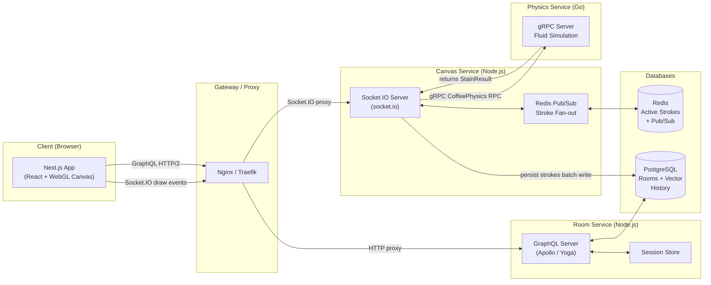
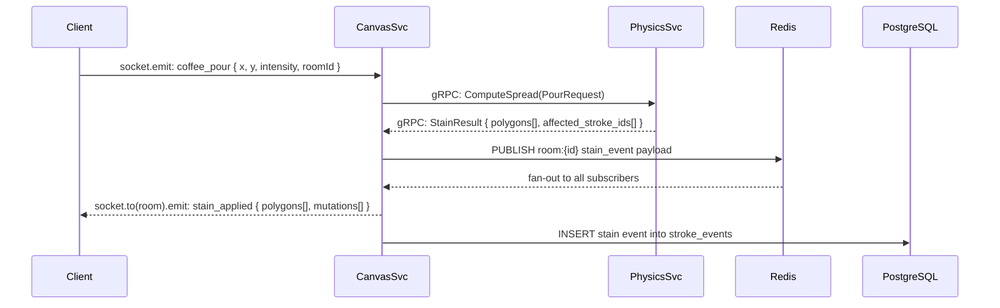

# Coffee & Canvas - Collaborative Drawing Application

A real-time collaborative drawing application with physics-based coffee pour effects, built with a high-performance microservices architecture. Multiple users can share an infinite canvas, sketch freely, and trigger realistic fluid simulations that interact with existing artwork.

---

## Features

- **Real-time Collaborative Drawing**: Multi-user cursor presence and stroke broadcasting with <50ms latency.
- **Coffee Pour Physics**: Realistic fluid simulation (Go-powered) that spreads, stains, and blends with vector strokes.
- **Infinite Canvas**: WebGL-powered drawing surface with spatial chunking for efficient infinite panning and zooming.
- **Advanced Persistence**: Vector-based stroke history with server reconciliation and spatial indexing.

---

## Quick Start

1. **Prerequisites**

   ```bash
   # Ensure you have Docker and Docker Compose installed
   docker --version
   docker-compose --version
   ```

2. **Environment Setup**

   ```bash
   # Copy environment template
   cp .env.example .env

   # Edit .env with your configuration (optional for development)
   ```

3. **Start Development Environment**

   ```bash
   # Start all services
   npm run dev

   # View logs
   npm run dev:logs

   # Stop services
   npm run dev:down
   ```

4. **Access the Application**
   - **Frontend**: [http://localhost:3000](http://localhost:3000)
   - **Canvas Service**: [http://localhost:3001](http://localhost:3001)
   - **Room Service**: [http://localhost:3002](http://localhost:3002)
   - **Physics Service**: gRPC on `localhost:50051`

---

## System Architecture

Coffee & Canvas follows a decoupled microservices architecture designed for low-latency synchronization and intensive physics computations.

### Architectural Overview



### Microservices Breakdown

| Service             | Technology Stack             | Responsibility                                                               |
| :------------------ | :--------------------------- | :--------------------------------------------------------------------------- |
| **Frontend**        | Next.js, PixiJS, Apollo      | WebGL rendering, local optimistic updates, and UI management.                |
| **Canvas Service**  | Node.js, Socket.IO, Redis    | Real-time event broadcasting, active stroke caching, and gRPC orchestration. |
| **Room Service**    | Node.js, GraphQL, PostgreSQL | Room management, authentication (JWT), and persistent stroke history.        |
| **Physics Service** | Go, gRPC                     | Particle-based fluid simulation for coffee pour effects.                     |

### Data Flow: Coffee Pour Event

When a user initiates a "Coffee Pour", the system executes a high-frequency synchronized flow to ensure all clients see the physics simulation simultaneously.



---

## Development

### Project Structure

```
├── services/
│   ├── canvas-service/     # Real-time drawing operations
│   ├── room-service/       # Room management & auth
│   ├── physics-service/    # Coffee pour physics (Go)
│   └── database/           # Database initialization
├── frontend/               # Next.js + PixiJS frontend
├── shared/                 # Shared types, protos, and utils
└── docker-compose.yml     # Container orchestration
```

### Building Individual Services

```bash
# Build all services
npm run build

# Build specific service (example)
cd services/canvas-service && npm run build
```

### Running Tests

```bash
# Run all tests
npm run test

# Run tests for specific service
cd services/canvas-service && npm run test
```

---

## Performance Targets

- **Drawing Latency**: <50ms for stroke broadcast between clients.
- **Physics Simulation**: <100ms for fluid spread calculations in the Go service.
- **Rendering**: Consistent 60 FPS using WebGL (PixiJS) even on large canvases.
- **Scalability**: Optimized for 50+ concurrent users per room with spatial partitioning.

## License

MIT License - see [LICENSE](LICENSE) file for details.
